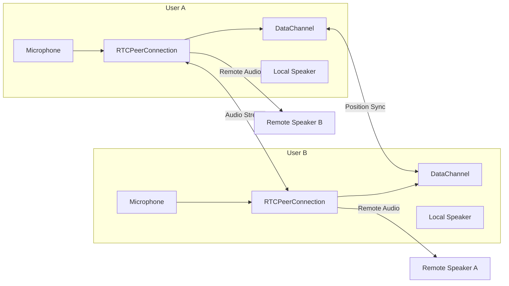
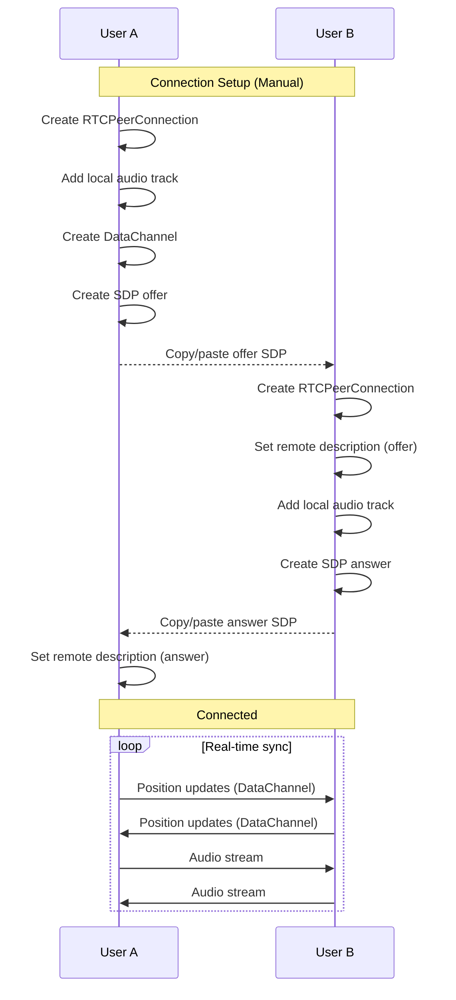

# Multiplayer POC Implementation Plan

A step-by-step guide for implementing peer-to-peer spatial audio between two users using raw WebRTC with manual SDP exchange.

## Architecture Overview



## Data Flow



---

## Step 1: Create WebRTC Types

Add new types to `packages/types/src/audio.ts` for multiplayer state.

```typescript
// Peer connection state
export type PeerConnectionState =
  | "new"
  | "connecting"
  | "connected"
  | "disconnected"
  | "failed";

// Remote peer data synced via DataChannel
export interface RemotePeerState {
  peerId: string;
  position: Position;
  facing: number;
  isSpeaking: boolean;
}

// Message types for DataChannel
export type DataChannelMessage =
  | { type: "position"; position: Position; facing: number }
  | { type: "speaking"; isSpeaking: boolean };
```

---

## Step 2: Create `useWebRTC` Hook

New file: `src/lib/hooks/useWebRTC.ts`

This hook manages the WebRTC connection lifecycle with manual signaling.

**Key responsibilities:**

- Create and manage `RTCPeerConnection`
- Handle ICE candidate gathering (included in SDP for simplicity)
- Create offer/answer SDPs for copy-paste exchange
- Manage `RTCDataChannel` for position sync
- Handle incoming/outgoing audio streams

**Core API:**

```typescript
interface UseWebRTCReturn {
  // Connection state
  connectionState: Accessor<PeerConnectionState>;
  localSdp: Accessor<string>; // SDP to copy

  // Actions
  createOffer: () => Promise<void>; // Initiator calls this
  setRemoteSdp: (sdp: string) => Promise<void>; // Paste remote SDP
  disconnect: () => void;

  // Remote data
  remoteStream: Accessor<MediaStream | null>;
  remotePeerState: Accessor<RemotePeerState | null>;

  // Local data to send
  sendPosition: (position: Position, facing: number) => void;
  sendSpeakingState: (isSpeaking: boolean) => void;
}
```

**Implementation notes:**

- Use `iceGatheringState === 'complete'` before exposing SDP (includes all ICE candidates)
- STUN server: `stun:stun.l.google.com:19302` for NAT traversal
- DataChannel: `negotiated: true, id: 0` for symmetric setup

---

## Step 3: Create `useRemoteSpeaker` Hook

New file: `src/lib/hooks/useRemoteSpeaker.ts`

Manages a remote peer's audio stream through the spatial audio system.

**Responsibilities:**

- Create audio nodes for remote stream: `MediaStreamAudioSourceNode` -> `StereoPannerNode` -> `GainNode` -> destination
- Update spatial parameters based on remote peer position
- Integrate with existing `calculateAudioParameters()` from `spatial-audio-engine.ts`

**Core API:**

```typescript
interface UseRemoteSpeakerReturn {
  // Bind remote stream to audio output
  setRemoteStream: (stream: MediaStream | null) => void;

  // Update remote peer position (from DataChannel)
  updateRemotePosition: (position: Position, facing: number) => void;

  // Calculated audio parameters
  audioParams: Accessor<AudioParameters | null>;
}
```

---

## Step 4: Add Connection UI Components

### 4.1 Connection Panel

New file: `src/components/audio/FullDemo/components/panels/ConnectionPanel.tsx`

UI for manual SDP exchange:

```
┌─────────────────────────────────────┐
│ Multiplayer Connection              │
├─────────────────────────────────────┤
│ Status: ● Disconnected              │
│                                     │
│ [Create Offer] or [Paste Offer]     │
│                                     │
│ ┌─────────────────────────────────┐ │
│ │ (SDP textarea - copy/paste)    │ │
│ └─────────────────────────────────┘ │
│                                     │
│ [Copy to Clipboard] [Apply]         │
│                                     │
│ [Disconnect]                        │
└─────────────────────────────────────┘
```

### 4.2 Remote Speaker Indicator

Update `SpatialCanvas.tsx` to render remote peer as a distinct speaker icon:

- Different color/icon to distinguish from local speakers
- Show remote peer's position and facing direction
- Visual indicator when remote peer is speaking

---

## Step 5: Integrate with DemoContext

Update `src/components/audio/FullDemo/context/DemoContext.tsx`:

1. Add WebRTC hook instance
2. Add remote speaker hook instance
3. Create derived state for remote peer speaker
4. Update audio parameter calculations to include remote speaker
5. Sync local speaker position changes to DataChannel

**Key additions to context:**

```typescript
// Add to context state
const webrtc = useWebRTC(audioStore.audioContext);
const remoteSpeaker = useRemoteSpeaker(audioStore.audioContext);

// Sync remote stream when connected
createEffect(() => {
  remoteSpeaker.setRemoteStream(webrtc.remoteStream());
});

// Send position updates when local speaker moves
createEffect(() => {
  const speaker = speakers().find((s) => s.id === currentPerspective());
  if (speaker && webrtc.connectionState() === "connected") {
    webrtc.sendPosition(speaker.position, speaker.facing);
  }
});
```

---

## Step 6: Add Sidebar Tab for Connection

Update `src/components/audio/FullDemo/components/Sidebar/Sidebar.tsx`:

Add new tab "Connection" alongside existing tabs (Speakers, Rooms, Audio Settings).

---

## File Structure

```
src/lib/hooks/
├── useWebRTC.ts          # NEW: WebRTC connection management
├── useRemoteSpeaker.ts   # NEW: Remote audio spatialization
└── index.ts              # Update exports

src/components/audio/FullDemo/components/panels/
├── ConnectionPanel.tsx   # NEW: SDP exchange UI
└── index.ts              # Update exports

packages/types/src/
└── audio.ts              # Update: Add multiplayer types
```

---

## Connection Flow (User Instructions)

**User A (Initiator):**

1. Click "Create Offer"
2. Wait for ICE gathering (status shows "Gathering...")
3. Copy the generated SDP
4. Send to User B (chat, email, etc.)
5. Paste User B's answer SDP
6. Click "Apply" - connected!

**User B (Responder):**

1. Paste User A's offer SDP
2. Click "Apply" - this auto-creates answer
3. Copy the generated answer SDP
4. Send to User A
5. Connected!

---

## Testing Strategy

1. **Unit tests** for `useWebRTC` hook (mock RTCPeerConnection)
2. **Unit tests** for `useRemoteSpeaker` hook
3. **Manual testing** with two browser windows/devices
4. **Test scenarios:**

- Connection establishment
- Position sync accuracy
- Audio spatialization of remote peer
- Reconnection after disconnect

---

## Technical Notes

- **ICE Candidates**: Using `icegatheringstatchange` to wait for complete gathering before exposing SDP (simplifies manual exchange)
- **STUN Only**: No TURN server needed for POC (works for most NAT types)
- **Audio Constraints**: `{ echoCancellation: true, noiseSuppression: true }` for better voice quality
- **DataChannel**: JSON messages, reliable ordered delivery (default)

---

## Future Enhancements (Out of POC Scope)

- Automatic signaling server (WebSocket)
- Multi-peer support (mesh or SFU)
- TURN server for symmetric NAT
- Connection quality indicators
- Reconnection logic
